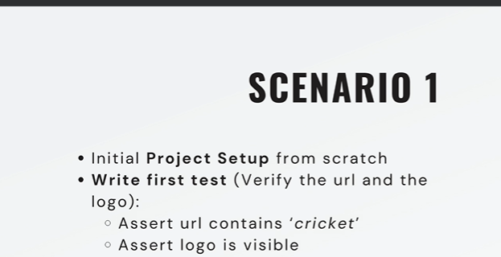
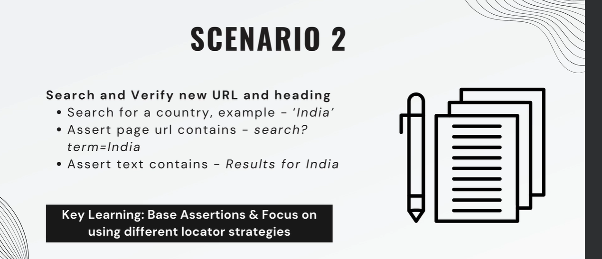
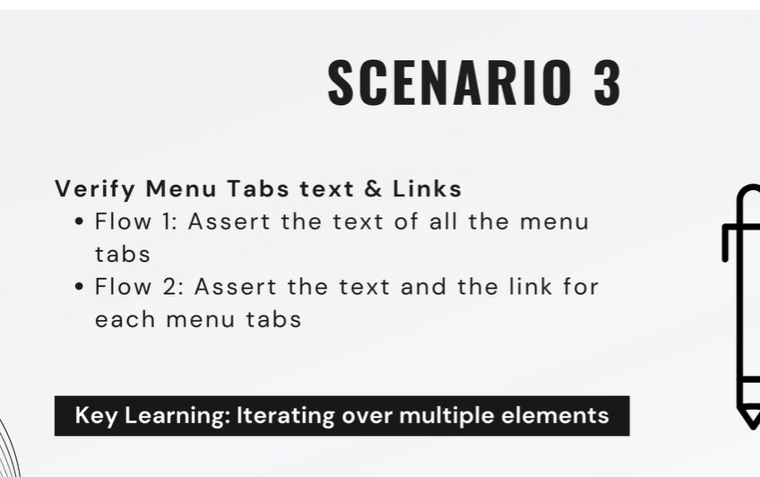
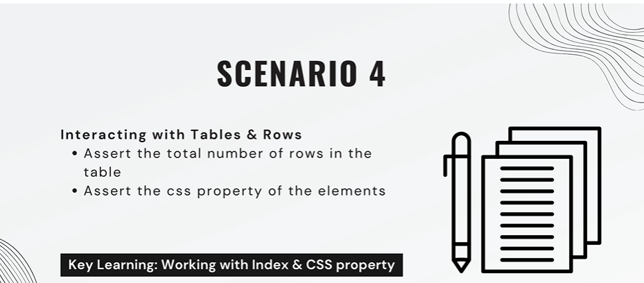
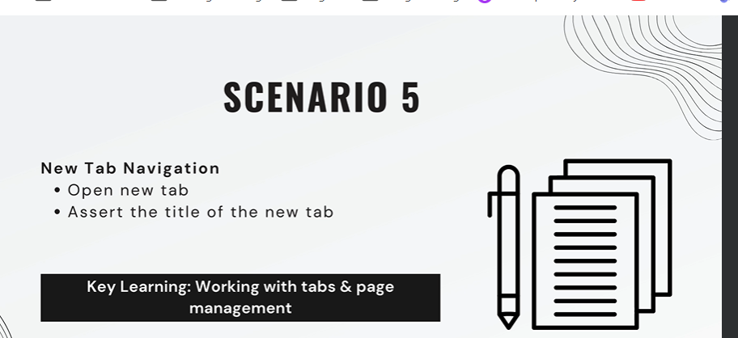
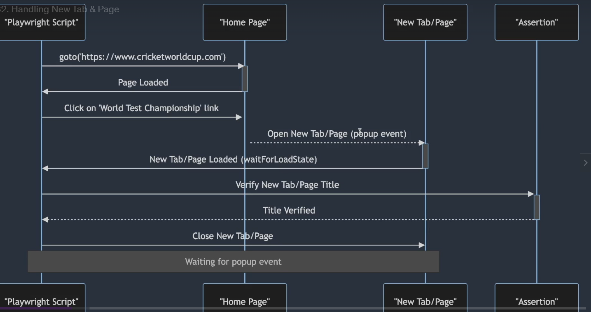
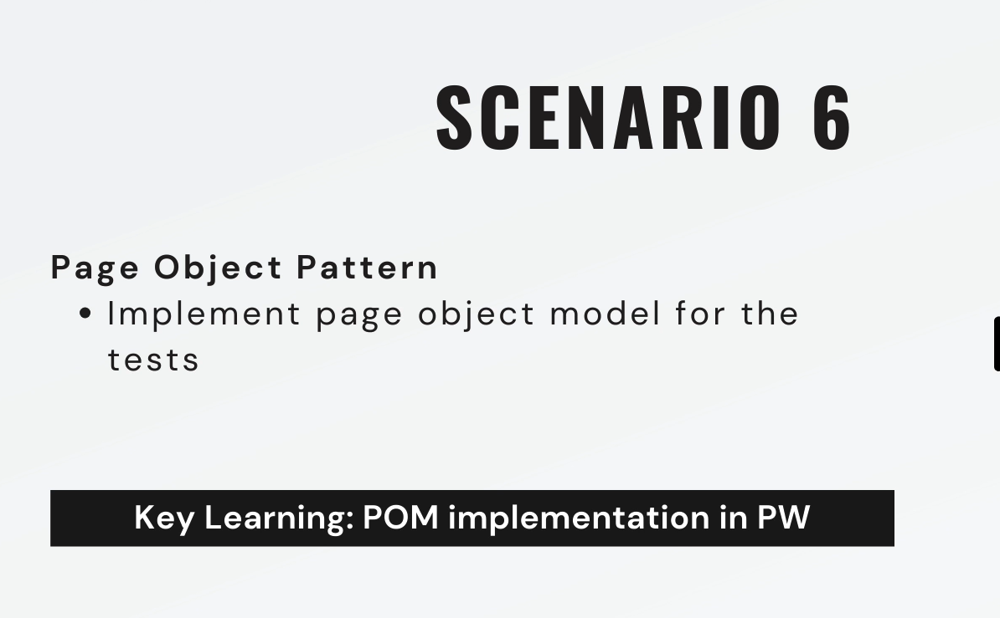
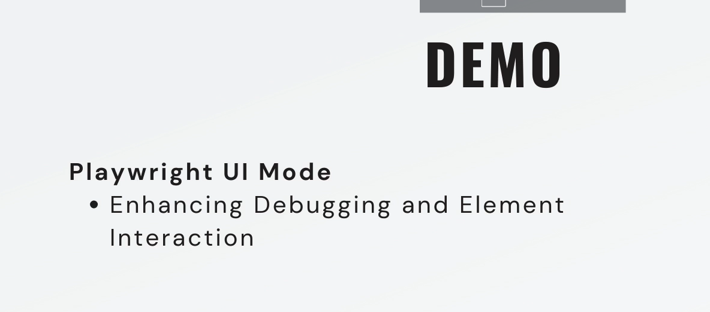

Link web Practice: https://www.icc-cricket.com/tournaments/cricketworldcup

## SCENARIO 1
Request: 
1.1 Note: //playwright.connfig.ts
1.2 Edit
{
      name: 'chromium',
      use: { ...devices['Desktop Chrome'] ,
      headless : false} // "headless" (không có giao diện người dùng), đặt true false để set có hiện giao diện browser lúc run test
    },

## SCENARIO 2
Request: 
Goals: Working with Assertions & Locators

-- Study: Khi press hoặc click vào element đợi chuyển qua URL mới, Đợi trang load xong mới action tiếp thì nên:
 <!-- await page.getByPlaceholder('what are you looking for?').fill("Indian");
    const navigationPromise = page.waitForNavigation();
    await page.keyboard.press('Enter');
    await navigationPromise; -->
Nên sử dụng hàm page.waitForNavigation()

## SCENARIO 3
Request: 
Goals: Handling Multiple Elements

--Study:
1. for (const [index,listItem] of expectMenuTab.entries()){}
-- Đây là một destructuring assignment, trong đó [index, listItem] là cách khai báo một mảng gồm hai phần tử. Trong mỗi lần lặp, nó sẽ lấy một cặp [index, value] từ iterator và gán phần tử đầu tiên (chỉ số) vào biến index và phần tử thứ hai (giá trị) vào biến listItem.
-- expectMenuTab.entries():  Phương thức entries() được gọi trên mảng expectMenuTab để tạo ra một iterator cho mảng đó. Iterator này sẽ trả về một chuỗi các cặp [index, value], trong đó index là chỉ số của phần tử và value là giá trị của phần tử.
2. const link = menuTab.nth(index).locator('a');
 Dòng này lấy ra phần tử a (liên kết) tương ứng với mỗi listItem trong menu. Điều này được thực hiện bằng cách sử dụng chỉ số index để truy cập vào phần tử tương ứng trong menuTab.
 Phương thức nth(index) được sử dụng để chọn phần tử con thứ index. Sau khi chọn được phần tử con thứ index từ menuTab, tiếp theo là .locator('a'), đây là phương thức locator() được sử dụng để chọn một phần tử con bằng cách sử dụng một bộ chọn CSS hoặc một xpath. Trong trường hợp này, 'a' là một bộ chọn CSS, nó chọn ra tất cả các phần tử a con của phần tử đã chọn bởi nth(index).

## SCENARIO 4
# Request: 
1. 
2. Access a Table Row With Unique Text From a Cell in Playwright (https://playwrightsolutions.com/access-a-table-row-with-a-unique-id-in-playwright/)

# Goal: 
Working with tables and Rows

# STUDY
Nói chung là đề có đổi cỡ nào thì làm ơn xác định đúng cái locator của element đó đi má ơi, rồi muốn làm gì cũng được.

## SCENARIO 5

# Page pratice: https://www.icc-cricket.com/

# Request:  && 
Goal: New tab and wait for event

# STUDY
- Phân biệt: waitForEvent && waitForLoadState && waitFor()

-- waitForEvent: đợi 1 sự kiện cụ thể xảy ra trên một đối tượng, như "click", "input"
-- waitForLoadState : đợi một trạng thái cụ thể của trang web, như "doncontentloaded"
-- waitFor(): chỉ dùng với locator.waitFor(), không dùng cho page như 2 thằng trên. 

- Trạng thái 'DOMContentLoaded': một sự kiện được kích hoạt khi toàn bộ HTML của trang web đã được tải và phân tích hoàn toàn. thời điểm mà trình duyệt đã xây dựng cây DOM hoàn chỉnh và sẵn sàng để được tương tác.

- const [newPage] = await Promise.all([
            page.waitForEvent('popup'),
             page.locator('//img[@alt="coca-cola"]').click(),
        ])
  
Trong JavaScript, khi bạn sử dụng phương thức Promise.all(), nó nhận vào một mảng các promise và trả về một promise mới. Promise này sẽ được giải quyết (resolve) khi tất cả các promise trong mảng đã được giải quyết.

Trong đoạn mã của bạn, bạn sử dụng Promise.all() để chờ đợi cả hai điều kiện: sự kiện popup (page.waitForEvent('popup')) và việc click vào hình ảnh ('//img[@alt="coca-cola"]'). Khi cả hai điều kiện này đều đã được thỏa mãn (resolve), Promise.all() sẽ trả về một mảng chứa kết quả của cả hai promise.

Để lấy kết quả của mảng này, bạn sử dụng cú pháp "destructuring" của JavaScript, trong đó [newPage] được sử dụng để gán giá trị của mảng trả về từ Promise.all() vào biến newPage. Trong trường hợp này, newPage sẽ chứa kết quả của promise đầu tiên trong mảng, tức là promise trả về từ page.waitForEvent('popup').

Tóm lại, [newPage] là cách để lấy giá trị trả về từ promise của page.waitForEvent('popup') từ mảng kết quả trả về từ Promise.all().

## SCENARIO 6

# Request: 
- Using scenario 1, 2 to do excersice 

# GOALS
Implementing Page Object Model

## SCENARIO 7

# Request: 

# GOAL: 
- Enhancing Debugging and Element Interaction

# Practice
1. Viết câu lệnh run test: npx playwright test --ui